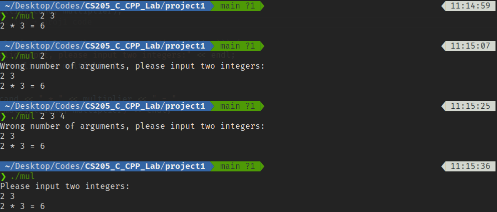
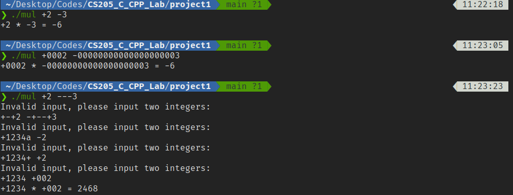
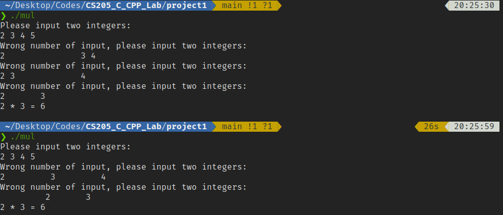
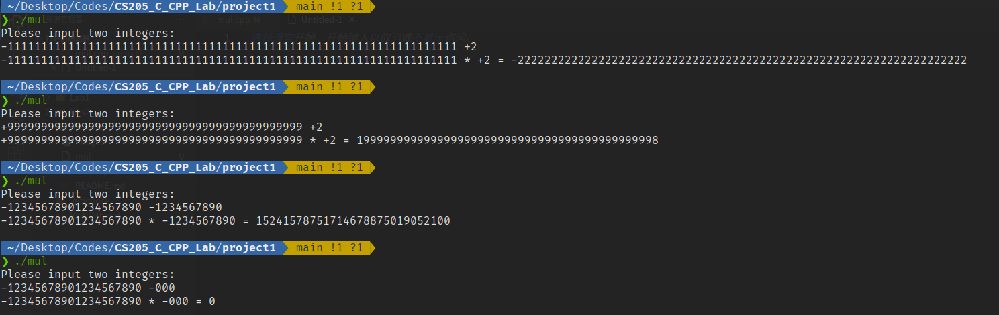

# CS205 Project 1 Report

11812804 董正

---

## 1 Introduction

### 1.1 Project Description

This project is to implement a calculator that can multiply any two integers.

Mainly, it has two functions:

1. Input validation
2. Big integer multiplication

### 1.2 Development Environment

* `Ubuntu 20.04.2 LTS x86_64` with `Linux 5.8.0-50-generic`
* `g++ (Ubuntu 9.3.0-17ubuntu1~20.04) 9.3.0`
* C++ standard: `c++11`

---

## 2 Design and Implementation

### 2.1 Input Validation

Macros and helper functions used in this section:

```c++
#define LF 10     // ASCII code for \n
#define SP 32     // ASCII code for space

bool check_valid(string input_str);
void read_input(string &multiplicand, string &multiplier);
```

* Check # of arguments by `argc`

  * `argc=3`

    Read multiplicand and multiplier from `argv[1], argv[2]`.

  * `argc=1`

    Ask user to input two integers.

  * Others

    Print error message and ask user to re-input.

  **Implementation:**

  ```c++
  if (argc == 3) {
      multiplicand = argv[1];
      multiplier = argv[2];
  } else {
      if (argc != 1)
          cout << "Wrong number of arguments, please input two integers:" << endl;
      else
          cout << "Please input two integers:" << endl;
  
      read_input(multiplicand, multiplier);
  }
  ```

  **Test cases:**

  

* Check if input string is a number

  Use a regular expression to match numbers, including one leading `+` or `-`.

  Multiple leading zeros are allowed.

  **Implementation:**

  ```c++
  #include <regex>
  
  regex number_regexp("(\\+?|-)\\d+");
  
  bool check_valid(string input_str) {
      return regex_match(input_str, number_regexp);
  }
  
  int main(int argc, char const *argv[]) {
      //...
          
  	while (!(check_valid(multiplicand) && check_valid(multiplier))) {
          cout << "Invalid input, please input two integers:" << endl;
          read_input(multiplicand, multiplier);
      }
      
      //...
  }
  ```

  **Test cases:**

  

* Check # of input integers

  If more than two integers, ask user to re-input.

  Used when the program need to get input from `stdin`.

  Multiple whitespaces before, between or after the two numbers are allowed. (eg.    2     3          ) 

  **Implementation:**
  
  ```c++
  void clear_stdin() {
      while (getchar() != '\n');
  }
  
  void read_input(string &multiplicand, string &multiplier) {
      cin >> multiplicand >> multiplier;
  
      char nextchar;
      while ((nextchar = getchar()) != LF) {
          if (nextchar != SP) {
              clear_stdin();
              cout << "Wrong number of input, please input two integers:" << endl;
              cin >> multiplicand >> multiplier;
          }
      }
  }
  ```
  
  **Test cases:**
  
  

### 2.2 Big Integer Multiplication

Macros and helper functions used in this section:

```c++
#define NUL 0     // ASCII code for null
#define MINUS 45  // ASCII code for '-'

int get_sign(string &number);
```

**Design:**

Considering the overflow problem of using integer data types like `long long`, it is necessary to simulate the manual calculation steps, which means multiplying digit-by-digit.

Following are the steps:

1. Determine the sign of the result.
2. Define an integer array to store intermediate result.
3. Do multiplication digit by digit, and store the product to the corresponding position of the array.
4. Calculate carry and add it to the next digit.
5. Export the data in the array to a string, and add sign to it.

And there are also some points need to be noticed:

* The index of the highest digit of a number is 0 when stored in a string, which is opposite to common sense.
* Handle the consecutive zeros in the array when exporting it to a result string.
* When any number multiplied by zero.

**Implementation:**

```c++
int get_sign(string &number) {
    int sign;
    if (number[0] == '-') {
        sign = -1;
        number = &number[1];
    } else {
        sign = 1;
        if (number[0] == '+')
            number = &number[1];
    }
    return sign;
}

string multiply(string &multiplicand, string &multiplier) {
    int sign1 = get_sign(multiplicand);
    int sign2 = get_sign(multiplier);
    char sign = sign1 * sign2 > 0 ? NUL : MINUS; // sign of result

    int sum_len = multiplicand.length() + multiplier.length();
    int temp[sum_len];
    memset(temp, 0, sizeof(temp));

    for (int i = multiplier.length() - 1; i >= 0; i--)
        for (int j = multiplicand.length() - 1; j >= 0; j--) {
            if (DEBUG)
                cout << "i=" << i << ", j=" << j << ": " << multiplier[i] - '0'
                     << "*" << multiplicand[j] - '0' << endl;
            temp[sum_len - 2 - (i + j)] += (multiplicand[j] - '0') * (multiplier[i] - '0');
        }

    for (int i = 0; i < sum_len; i++) {
        temp[i + 1] += temp[i] / 10;
        temp[i] %= 10;
    }

    string result;
    result.push_back(sign);
    bool flag = 0;
    for (int i = sum_len - 1; i >= 0; i--) {
        if (temp[i] != 0) 
            flag = 1;
        if (flag) 
            result.push_back(temp[i] + '0');
    }

    if (!flag)
        result="0";

    return result;
}
```

**Test cases:**



---

## 3 Conclusion

In this project, I design and implemented a simple muliplication calculator. And I learned how to handle standard input in `C++` and some basic operations of string and array. The main difficuty I met is that I am not familiar with `C++` syntax. There are so many differences between it and `Java, Python`. Therefore, I still have a lot of things to learn in the future classes.

