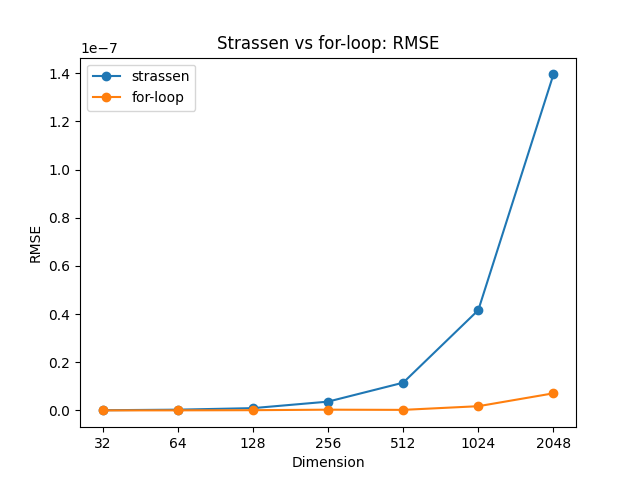

# CS205 Project 2 Report

11812804 董正

---

[TOC]

## 1 Introduction

### 1.1 Project Description

This project aims to implement a program to multiply two matrices in two files.

The requirements are:

1. Get file path from command line arguments

2. Implement the matrix multiplication in `float` and `double` separately

   Compare their speed and accuracy

3. Improve speed

In my code, I implemented **Strassen's algorithm** with `vector` in `C++`.

### 1.2 Development Environment

* `Windows 10 Home China x86_64`
* Kernel version `10.0.19042`
* `g++.exe (tdm64-1) 10.3.0`
* C++ standard: `c++11`

## 2 Design and Implementation

Header files and macros used in this section:

```c++
#include <ctime>
#include <fstream>
#include <iostream>
#include <vector>

#define USE_DOUBLE 1

#if USE_DOUBLE
    #define REAL_NUMBER double
    #define PRECISION 15
#else
    #define REAL_NUMBER float
    #define PRECISION 6
#endif

#define STRASSEN_LOWER_BOUND 128

typedef vector<vector<REAL_NUMBER>> matrix;
```

### 2.1 Matrix Construction

Since there is no size told in the files, it is necessary to compute the size of the input matrix.

For convenience, I used 2-dimension `vector` as the data structure for matrix.

To read a matrix, keep appending new numbers to the row vector. In the meantime, use `get()` function to test if it reaches `\n` and create a new vector. And if there is a blank line at the end of the file, which means `\nEOF`, do nothing. Use `peek()` to achieve this.

**Implementation:**

```c++
matrix read_matrix(const char *file_name) {
    ifstream in(file_name);
    if (!in.is_open()) {
        cout << "Error opening file." << endl;
        exit(EXIT_FAILURE);
    }

    matrix m;

    REAL_NUMBER temp;
    int i = 0, j = 0;
    m.push_back(vector<REAL_NUMBER>());
    while (in >> temp) {
        m[i].push_back(temp);
        if (in.get() == '\n' && in.peek() != EOF) {
            m.push_back(vector<REAL_NUMBER>());
            i++;
            j = 0;
        }
    }

    in.close();
    return m;
}
```

### 2.2 Write Matrix to File

By default, the significant digits of a `float` or `double` number is 6. So it is essential to set the precison of the out stream. For example, 15 for `double`.

**Implementation:**

```c++
void print_matrix(matrix m, const char *file_name) {
    ofstream out(file_name);
    out.precision(PRECISION);

    for (int i = 0; i < m.size(); i++) {
        for (int j = 0; j < m[0].size(); j++) {
            out << m[i][j] << " ";
        }
        out << endl;
    }

    out.close();
}
```

---

### 2.3 For-loop Matrix Multiplication

The naive algorithm for matrix multiplication is to use a triple nested for-loop.
$$
C_{ij}=\sum_{k=1}^n A_{ik}\cdot B_{kj}
$$
**Implementation:**

```c++
matrix multiply_matrix(matrix m1, matrix m2) {
    // a*b dot b*c = a*c
    int nrows = m1.size();
    int ncols = m2[0].size();
    int intermediate = m2.size();

    if (intermediate != m1[0].size()) {
        cout << "Multiplication error: matrix dimension cannot match."
             << " (" << m1.size() << "*" << m1[0].size() << " dot " << m2.size()
             << "*" << m2[0].size() << ")" << endl;
        exit(EXIT_FAILURE);
    }

    matrix product(nrows, vector<REAL_NUMBER>(ncols, 0));

    for (int i = 0; i < nrows; i++)
        for (int k = 0; k < intermediate; k++)
            for (int j = 0; j < ncols; j++) {
                product[i][j] += m1[i][k] * m2[k][j];
            }

    return product;
}
```

Here I swapped the order of for-$k$ and for-$j$ in order to accelerate the speed.

By swapping $k$ and $j$, the program can read memory consecutively, which can save memory access time.

---

### 2.4 Strassen's Algorithm

Since the dimension of the given matrices are a power of two, we can use **Strassen's algorithm** to increase the speed.

Volker Strassen published his algorithm in 1969. It was the first algorithm to prove that the basic $O(n^3)$ runtime was not optimal.

Suppose $C=AB$. The basic idea behind Strassen's algorithm is to split $A$ and $B$ into 8 submatrices and then recursively compute the submatrices of $C$.

#### 2.4.1 Methodology

Suppose $A, B$ are square and the dimension of $A, B$ are a power of two and $\dim(A)=\dim(B)$.

Then we can represent them as:
$$
A=\begin{bmatrix}A_{11} & A_{12}\\ A_{21} & A_{22} \end{bmatrix}, B=\begin{bmatrix}B_{11} & B_{12}\\ B_{21} & B_{22} \end{bmatrix}
$$
And
$$
C=\begin{bmatrix}C_{11} & C_{12}\\ C_{21} & C_{22} \end{bmatrix}
$$
Then, compute ten matrices $S_1, S_2, \dots, S_{10}$
$$
\begin{aligned}
S_1&=B_{12}-B_{22}\\
S_2&=A_{11}+A_{12}\\
S_3&=A_{21}+A_{22}\\
S_4&=B_{21}-B_{11}\\
S_5&=A_{11}+A_{22}\\
S_6&=B_{11}+B_{22}\\
S_7&=A_{12}-A_{22}\\
S_8&=B_{21}+B_{22}\\
S_9&=A_{11}-A_{21}\\
S_{10}&=B_{11}+B_{12}
\end{aligned}
$$
After that, compute seven matrices $P_1, P_2, \dots, P_7$ recursively
$$
\begin{aligned}
P_1&=A_{11}S_{1}\\
P_2&=S_2B_{22}\\
P_3&=S_3B_{11}\\
P_4&=A_{22}S_4\\
P_5&=S_5S_6\\
P_6&=S_7S_8\\
P_7&=S_9S_{10}
\end{aligned}
$$
And finally
$$
\begin{aligned}
C_{11}&=P_5+P_4-P_2+P_6\\
C_{12}&=P_1+P_2\\
C_{21}&=P_3+P_4\\
C_{22}&=P_5+P_1-P_3-P_7
\end{aligned}
$$

#### 2.4.2 Time Complexity

$$
T(n)=\Theta(n^{\log_27})\approx\Theta(n^{2.807})
$$

Approximately, when $n=296$, **Strassen's algorithm** will give 3x speed acceleration.


#### 2.4.3 Helper Functions: Matrix Addition and Subtraction

Because we will use matrix addition and subtraction in **Strassen's algorithm**.
$$
\forall i, j, C_{ij}=A_{ij}\pm B_{ij}
$$
**Implementation:**

```c++
matrix add_matrix(matrix m1, matrix m2) {
    if (m1.size() != m2.size() || m1[0].size() != m2[0].size()) {
        cout << "Add error: matrix dimension cannot match."
             << " (" << m1.size() << "*" << m1[0].size() << " + " << m2.size()
             << "*" << m2[0].size() << ")" << endl;
        exit(EXIT_FAILURE);
    }

    matrix res(m1.size(), vector<REAL_NUMBER>(m1[0].size(), 0));

    for (int i = 0; i < m1.size(); i++)
        for (int j = 0; j < m1[0].size(); j++) {
            res[i][j] = m1[i][j] + m2[i][j];
        }

    return res;
}

matrix sub_matrix(matrix m1, matrix m2) {
    if (m1.size() != m2.size() || m1[0].size() != m2[0].size()) {
        cout << "Subtraction error: matrix dimension cannot match."
             << " (" << m1.size() << "*" << m1[0].size() << " - " << m2.size()
             << "*" << m2[0].size() << ")" << endl;
        exit(EXIT_FAILURE);
    }

    matrix res(m1.size(), vector<REAL_NUMBER>(m1[0].size(), 0));

    for (int i = 0; i < m1.size(); i++)
        for (int j = 0; j < m1[0].size(); j++) {
            res[i][j] = m1[i][j] - m2[i][j];
        }

    return res;
}
```

#### 2.4.4 Helper Functions: Matrix Decomposition and Combination

In the first step, we should split the matrix into 4 submatrices.

And in the last step, we should construct $C$ from the 4 submatrices.

Therefore, we need two helper functions to decompose and combine 2-dimension vectors.

For decomposition, use iterator to construct a new vector.

And for combination, use `insert()` to connect two vectors.

**Implementation:**

```c++
// [start, end)
matrix slice_matrix(matrix m, int row_start, int row_end, int col_start,
                    int col_end) {
    matrix res;

    for (int i = row_start; i < row_end; i++) {
        res.push_back(vector<REAL_NUMBER>(m[i].begin() + col_start,
                                          m[i].begin() + col_end));
    }

    return res;
}

matrix merge_matrix(matrix C11, matrix C12, matrix C21, matrix C22) {
    matrix C;

    for (int i = 0; i < C11.size(); i++) {
        C11[i].insert(C11[i].end(), C12[i].begin(), C12[i].end());
    }

    for (int i = 0; i < C21.size(); i++) {
        C21[i].insert(C21[i].end(), C22[i].begin(), C22[i].end());
    }

    C.insert(C.end(), C11.begin(), C11.end());
    C.insert(C.end(), C21.begin(), C21.end());

    return C;
}
```

#### 2.4.5 Implementation

1. Check if the size satisfies the requirement of Strassen's algorithm

   Use `n & (n-1) == 0` to determine whether `n` is a power of two.

2. Termination condition of recursion

   If `N <= STRASSEN_LOWER_BOUND`, use regular matrix multiplication.

   Because when $N$ is small, for-loop is much faster. Details will be given in section [3.6](#3.6).

3. Use the above helper functions to calculate intermediate matrices.

4. Combine $C_{11}, C_{12}, C_{21}, C_{22}$ to get $C$

5. Return $C$

```c++
matrix strassen(matrix A, matrix B) {
    if (A.size() != B.size() || A[0].size() != B[0].size()) {
        cout << "Strassen multiplication error: matrix dimension cannot match."
             << endl;
        exit(EXIT_FAILURE);
    }

    int N = A.size();

    if ((N & (N - 1)) != 0) {
        cout << "Strassen multiplication error: matrix dimension is not 2^n."
             << endl;
        exit(EXIT_FAILURE);
    }

    if (N <= STRASSEN_LOWER_BOUND) {
        return multiply_matrix(A, B);
    }

    matrix A11 = slice_matrix(A, 0, N / 2, 0, N / 2);
    matrix A12 = slice_matrix(A, 0, N / 2, N / 2, N);
    matrix A21 = slice_matrix(A, N / 2, N, 0, N / 2);
    matrix A22 = slice_matrix(A, N / 2, N, N / 2, N);

    matrix B11 = slice_matrix(B, 0, N / 2, 0, N / 2);
    matrix B12 = slice_matrix(B, 0, N / 2, N / 2, N);
    matrix B21 = slice_matrix(B, N / 2, N, 0, N / 2);
    matrix B22 = slice_matrix(B, N / 2, N, N / 2, N);

    matrix S1 = sub_matrix(B12, B22);
    matrix S2 = add_matrix(A11, A12);
    matrix S3 = add_matrix(A21, A22);
    matrix S4 = sub_matrix(B21, B11);
    matrix S5 = add_matrix(A11, A22);
    matrix S6 = add_matrix(B11, B22);
    matrix S7 = sub_matrix(A12, A22);
    matrix S8 = add_matrix(B21, B22);
    matrix S9 = sub_matrix(A11, A21);
    matrix S10 = add_matrix(B11, B12);

    matrix P1 = strassen(A11, S1);
    matrix P2 = strassen(S2, B22);
    matrix P3 = strassen(S3, B11);
    matrix P4 = strassen(A22, S4);
    matrix P5 = strassen(S5, S6);
    matrix P6 = strassen(S7, S8);
    matrix P7 = strassen(S9, S10);

    matrix C11 = add_matrix(P5, P4);
    C11 = sub_matrix(C11, P2);
    C11 = add_matrix(C11, P6);
    matrix C12 = add_matrix(P1, P2);
    matrix C21 = add_matrix(P3, P4);
    matrix C22 = add_matrix(P5, P1);
    C22 = sub_matrix(C22, P3);
    C22 = sub_matrix(C22, P7);

    matrix C = merge_matrix(C11, C12, C21, C22);

    return C;
}
```

### 2.5 Main Function

In the main function, I used `clock()` function to record the time used to read files and perform matrix multiplication.

What's more, the program can automatically select multiplication algorithm. If the input matrices do not satisfy the requirement of Strassen's algorithm, use for-loop.

```c++
int main(int argc, char const *argv[]) {
    if (argc != 4) {
        cout << "Wrong number of arguments.";
        exit(EXIT_FAILURE);
    }
    double start, end;

    start = clock();

    matrix m1 = read_matrix(argv[1]);
    matrix m2 = read_matrix(argv[2]);

    end = clock();
    cout << "Read file time: " << (end - start) / (double)1000 << "s" << endl;

    start = clock();

    matrix res;
    if ((m1.size() & (m1.size()-1)) == 0 && m1.size() == m1[0].size() &&
        (m2.size() & (m2.size()-1)) == 0 && m2.size() == m2[0].size() &&
        m1.size() == m2.size()
    ) {
        cout << "Using Strassen algorithm." << endl;
        res = strassen(m1, m2);
    } else {
        cout << "Using for-loop multiplication." << endl;
        res = multiply_matrix(m1, m2);
    }

    end = clock();
    cout << "Multiplication time: " << (end - start) / (double)1000 << "s" << endl;

    print_matrix(res, argv[3]);

    return 0;
}
```

## 3 Empirical Verification

This part is written in Python. See [Appendix. 1](#ap1) for code.

### 3.1 Test Platform

* `Windows 10 Home China x86_64`
* Kernel version `10.0.19042`
* `Python 3.8.5 (tags/v3.8.5:580fbb0, Jul 20 2020, 15:57:54) [MSC v.1924 64 bit (AMD64)]`
* `numpy 1.18.5`
* `matplotlib 3.3.3`

### 3.2 Evaluation Criterion

The test aims to evaluate speed and accuracy of the program.

For speed, record the time used for matrix multiplication, which is already introduced in section 2.5.

For accuracy, use `numpy.matmul()` as ground truth, then compute root mean squared error.
$$
RMSE=\sqrt{\frac 1n\sum_{i=1}^n (\hat y_i-y_i)^2}
$$

```python
def rmse(predictions, targets):
    return np.sqrt(np.mean((predictions - targets)**2))
```

The lower, the more accurate.

### 3.3 Dataset & Test Cases

The given matrices are 32, 256 and 2048 dimension.

For test, I generated 64, 128, 512 and 1024 dimension matrices based on the given 2048 dimension matrices.

```pyth
import numpy as np

if __name__ == "__main__":
    A=np.loadtxt("./mat-A-2048.txt")
    B=np.loadtxt("./mat-B-2048.txt")

    dims=[64, 128, 512, 1024]

    for dim in dims:
        np.savetxt(f"./mat-A-{dim}.txt", A[:dim, :dim], fmt="%.1f")
        np.savetxt(f"./mat-B-{dim}.txt", A[:dim, :dim], fmt="%.1f")
```

And the programs for test:

|            Program            | Data Type |       Algorithm       |
| :---------------------------: | :-------: | :-------------------: |
|      `matmul_double.cpp`      | `double`  | Strassen and for-loop |
|      `matmul_float.cpp`       |  `float`  | Strassen and for-loop |
|     `matmul_strassen.cpp`     | `double`  |       Strassen        |
|     `matmul_forloop.cpp`      | `double`  |       For-loop        |
| `matmul_strassen_forloop.cpp` | `double`  | Strassen and for-loop |

For "Strassen and for-loop", see details in section [3.6](#3.6).

Raw data is in [Appendix. 2](#ap2).

### 3.4 double vs. float

**Speed:**


The curves are almost the same. This is because `float` is converted to `double` when performing calculations.

**Accuracy:**


`double` is much more accurate. This is because `double` has more fraction bits (52), about 15 decimal digits. And this is why `#define PRECISION 15`.

### 3.5 Strassen vs. For-loop

**Speed:**


In contrast to my expectation, Strassen's algorithm is much slower than for-loop.

I think this is because I used too many `vector` operations in the algorithm, such as `slice_matirx()` and ` merge_matrix()`, which are very time-costing. And I start to regret about using `vector` to store matrices.

**Accuracy:**



For-loop is more accurate.

I think the reason is Strassen's algorithm contains plenty of floating point addition and subtraction. When performing these actions, the floating point numbers will lose precision. On the contrary, the operation of for-loop multiplication is very simple.

### <span id="3.6">3.6 Combine Strassen's Algorithm and For-loop</span>

Since for-loop takes advantage in dealing with small matrices, we can change the termination condition of Strassen's algorithm. When the dimension is less than or equal to some number, switch to for-loop multiplication.

```c++
if (N <= STRASSEN_LOWER_BOUND) {
    return multiply_matrix(A, B);
}
```

Here I found `STRASSEN_LOWER_BOUND = 128` is a good value.

**Speed:**


When dim=2048, the combined algorithm is about 30s faster than for-loop. So it is much faster.

**Accuracy:**


The accuracy of the combined algorithm is much higher than Strassen's algorithm.

## 4 Conclusion

In this project, I implemented Strassen's algorithm and used Python to design some test cases for different conditions. I learnt many `vector` operations and file manipulation methods. What's more, I used `matplotlib` to visualize the test results, which I never tried before.

**Future Impovement Directions:**

Still, the algorithm only support matrices whose dimension is a power of two. And there is "Common Strassen's Algorithm" that can support any matrices.

`vector` operations are very slow, maybe I should try to use array.

File I/O of the program is slow, need to find some faster ways.

## <span id="ap1">Appendix. 1: test.py</span>

```python
import numpy as np
import os
import matplotlib.pyplot as plt
import json


def rmse(predictions, targets):
    return np.sqrt(np.mean((predictions - targets)**2))


def plot_compare(x1, y1, x2, y2, label1, label2, title, xlabel_name,
                 ylabel_name, fig_path, ylimit: tuple=None):
    if ylimit:
        plt.ylim(ylimit)
    plt.plot(x1, y1, "o-", label=label1)
    plt.plot(x2, y2, "o-", label=label2)
    plt.title(title)
    plt.xlabel(xlabel_name)
    plt.ylabel(ylabel_name)
    plt.legend()
    plt.savefig(fig_path)
    plt.clf()


if __name__ == "__main__":
    dims = ["32", "64", "128", "256", "512", "1024", "2048"]
    cases = ["double", "float", "strassen", "forloop", "strassen_forloop"]
    time_cost_dict = {}
    rmse_dict = {}

    for case in cases:
        os.system("g++ matmul_{0}.cpp -o matmul_{0}".format(case))
        time_cost_dict[case] = []
        rmse_dict[case] = []

        for dim in dims:
            if case=="strassen" and dim=="2048":
                time_cost_dict[case].append(4800) # 如果真要跑大概 1 小时 20 分钟, 不方便画图
                rmse_dict[case].append(1.3950859156363537e-07)
                continue

            A = np.loadtxt(f"../data/mat-A-{dim}.txt")
            B = np.loadtxt(f"../data/mat-B-{dim}.txt")
            C = np.matmul(A, B)

            cout = os.popen(
                f"matmul_{case} ../data/mat-A-{dim}.txt ../data/mat-B-{dim}.txt ./out-{case}-{dim}.txt"
            ).read()
            time_cost = float(cout.split()[-1][:-1])
            time_cost_dict[case].append(time_cost)

            out = np.loadtxt(f"./out-{case}-{dim}.txt")
            rmse_dict[case].append(rmse(out, C))

            print(f"Finished {case}-{dim}")

    with open("./time_cost_dict.json", "w") as f:
        json.dump(time_cost_dict, f)
    with open("./rmse_dict.json", "w") as f:
        json.dump(rmse_dict, f)

    plot_compare(dims, time_cost_dict["double"], dims, time_cost_dict["float"],
                 "double", "float", 
                 "double vs float: time cost", 
                 "Dimension",
                 "Time/s", 
                 "../images/df_time_cost.png")
    plot_compare(dims, rmse_dict["double"], dims, rmse_dict["float"], 
                 "double", "float", 
                 "double vs float: RMSE", 
                 "Dimension", 
                 "RMSE",
                 "../images/df_rmse.png")

    plot_compare(dims, time_cost_dict["strassen"], dims, time_cost_dict["forloop"], 
                 "strassen", "for-loop",
                 "Strassen vs for-loop: time cost", 
                 "Dimension", 
                 "Time/s",
                 "../images/sf_time_cost.png",
                 ylimit=(-25, 550))
    plot_compare(dims, rmse_dict["strassen"], dims, rmse_dict["forloop"],
                 "strassen", "for-loop", 
                 "Strassen vs for-loop: RMSE",
                 "Dimension", 
                 "RMSE", 
                 "../images/sf_rmse.png")

    plt.plot(dims, time_cost_dict["strassen"], "o-", label="strassen")
    plt.plot(dims, time_cost_dict["forloop"], "o-", label="for-loop")
    plt.plot(dims, time_cost_dict["strassen_forloop"], "o-", label="strassen+for-loop")
    plt.title("Strassen + for-loop: time cost")
    plt.xlabel("Dimension")
    plt.ylabel("Time/s")
    plt.legend()
    plt.savefig("../images/s+f_time_cost.png")
    plt.clf()

    plt.plot(dims, rmse_dict["strassen"], "o-", label="strassen")
    plt.plot(dims, rmse_dict["forloop"], "o-", label="for-loop")
    plt.plot(dims, rmse_dict["strassen_forloop"], "o-", label="strassen+for-loop")
    plt.title("Strassen + for-loop: RMSE")
    plt.xlabel("Dimension")
    plt.ylabel("RMSE")
    plt.legend()
    plt.savefig("../images/s+f_rmse.png")
    plt.clf()

    print("Finished.")
```

## <span id="ap2">Appendix. 2: Raw Data of Test Results</span>

Time cost:

```json
{"double": [0.0, 0.002, 0.028, 0.191, 1.152, 8.293, 58.321], 
 "float": [0.0, 0.003, 0.023, 0.163, 1.134, 7.979, 58.091], 
 "strassen": [0.029, 0.208, 1.525, 10.475, 73.796, 521.855, 4800], 
 "forloop": [0.0, 0.003, 0.021, 0.176, 1.473, 11.358, 88.87], 
 "strassen_forloop": [0.0, 0.003, 0.022, 0.166, 1.164, 8.257, 56.155]}
```

RMSE:

```json
{"double": [1.3259999206478218e-11, 3.5073080395695516e-11, 1.0334527505674842e-10, 4.161035794077453e-10, 6.654338356356882e-10, 4.555616609288948e-09, 1.5208992007988598e-08], 
 "float": [0.07317105921189468, 0.28779006257469497, 0.29598391143477026, 0.34850993107530587, 2.9616588755646793, 3.737307585812131, 8.762262507045184], 
 "strassen": [8.16027617559909e-11, 3.1376644521815304e-10, 9.522083771739254e-10, 3.652269050630416e-09, 1.1517937120122013e-08, 4.164125460986317e-08, 1.3950859156363537e-07], 
 "forloop": [1.3259999206478218e-11, 3.5073080395695516e-11, 1.0334527505674842e-10, 3.115756985935899e-10, 2.324315094318261e-10, 1.7562295002750738e-09, 7.108342992317124e-09], 
 "strassen_forloop": [1.3259999206478218e-11, 3.5073080395695516e-11, 1.0334527505674842e-10, 4.161035794077453e-10, 6.654338356356882e-10, 4.555616609288948e-09, 1.5208992007988598e-08]}
```

