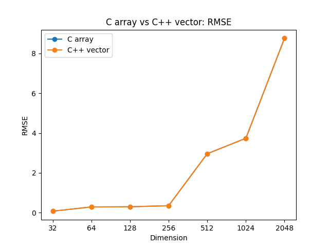

# CS205 Project 3 Report

11812804 董正

---

[TOC]

## 1 Introduction

**This is outdated, see project 5 for the lastest version of `matrix` class.**

### 1.1 Project Description

This project aims to implement a program to multiply two matrices in two files.

The requirements are:

1. Use `C`
2. Design a struct for matrices
3. Implement some functions
   * create a matrix
   * delete a matrix
   * copy a matrix
   * multiply two matrices
   * ...
4. Improve speed
5. Compare the speed with OpenBLAS

### 1.2 Development Environment

* `Windows 10 Home China x86_64`
* Kernel version `10.0.19042`
* `gcc.exe (tdm64-1) 10.3.0`
* C standard: `c11`

## 2 Design and Implementation

In this project, I implemented almost the same function interfaces as **project2**. Therefore, I think it is better not to waste my time (and your time) to introduce the usage of these functions again.

In the conclusion part of **project2**'s report, I mentioned:

>**Future Improvement Directions:**
>
>`vector` operations are very slow, maybe I should try to use array.
>
>File I/O of the program is slow, need to find some faster ways.

Therefore, I will focus on what has been **changed or improved** comparing to **project2**.

Header files and macros used in this section:

```c
#include <stdio.h>
#include <stdlib.h>
#include <time.h>

#define STRASSEN_LOWER_BOUND 128
#define NAN -1

typedef float REAL_NUMBER;
```

### 2.1 Matrix Construction: C Array

This project requires to design a struct for matrices:

```c
typedef struct
{
    int nrows;
    int ncols;
    REAL_NUMBER* data;
} matrix;
```

`data` is a 1D dynamic array containing all the elements of the matrix, while in **project2**, I used a nested 2D `vector` to represent matrix. 

```c++
typedef vector<vector<REAL_NUMBER>> matrix; // project 2
```

So let's see whether array will improve the speed in section 3.

To create a matrix:

```c
inline matrix create_matrix(int nrows, int ncols, REAL_NUMBER fill) {
    matrix m = {
        .nrows = nrows,
        .ncols = ncols,
        .data = (REAL_NUMBER*)malloc(nrows * ncols * sizeof(REAL_NUMBER))};

    if (fill != NAN) {
        for (int i = 0; i < nrows * ncols; i++) {
            m.data[i] = fill;
        }
    }

    return m;
}
```

Use `malloc` to allocate memory for the matrix in heap, in order not to run out of memory when dealing with big matrices.

However, system will not free the memory automatically. Thus, we should free `data` manually.

```c
inline void delete_matrix(matrix* m) {
    m->nrows = 0;
    m->ncols = 0;
    free(m->data);
    m->data = NULL;
}
```

Another point is, `data` is a 1D array. So I designed some helper functions to get and set the elements easily.

```c
inline REAL_NUMBER get_elem(matrix* m, int i, int j) {
    return m->data[i * m->ncols + j];
}

inline REAL_NUMBER* get_elem_ptr(matrix* m, int i, int j) {
    return m->data + (i * m->ncols + j);
}

inline void set_elem(matrix* m, int i, int j, REAL_NUMBER num) {
    m->data[i * m->ncols + j] = num;
}
```

For all these functions, I declared them as `inline` to speed up, which I just learned in the last lecture. 

What's more, it is important to pass-by-pointer:

1. Pass-by-value will make a copy of the matrix, which is very time and space-costing.
2. We can modify the members of the struct only by pointer (except the array). 
3. `C` does not have reference.

So we must use pointer for function parameter.

### 2.2 Read or Write Matrix: fscanf/fprintf

In **project2**, I used file I/O stream to read data from files, and it is very slow. In `C` implementation, I tried to use `fscanf/fprintf` (and there is no `cin` for me to use in `C`).

First, scan all the file to count the rows and columns. Then reset the offset and maintain a pointer to read the data sequentially.

```c
matrix read_matrix(const char* file_name) {
    FILE* fp = fopen(file_name, "r");
    matrix m;
    m.nrows = 0;
    m.ncols = 0;

    // get ncols and nrows
    REAL_NUMBER tempf = 0;
    char tempc = 1;
    while (tempc != '\n') {
        fscanf(fp, "%f", &tempf);
        fscanf(fp, "%c", &tempc);
        m.ncols++;
    }
    m.nrows++;
    while (fscanf(fp, "%c", &tempc) != EOF) {
        if (tempc == '\n') {
            m.nrows++;
        }
    }

    // read data
    rewind(fp);
    m.data = (REAL_NUMBER*)malloc(m.ncols * m.nrows * sizeof(REAL_NUMBER));
    REAL_NUMBER* pread = m.data;
    for (int i = 0; i < m.ncols * m.nrows; i++) {
        fscanf(fp, "%f", pread);
        pread++;
    }

    fclose(fp);
    return m;
}
```

And for write:

```c
void print_matrix(matrix* m, const char* file_name) {
    FILE* fp = fopen(file_name, "w");

    for (int i = 0; i < m->ncols * m->nrows; i++) {
        if (i > 0 && i % m->ncols == 0) {
            fputc('\n', fp);
        }
        fprintf(fp, "%g ", m->data[i]);
    }
    fputc('\n', fp);  // last blank line

    fclose(fp);
}
```

### 2.3 Replace Vector Operations By Array

In **project2**, I gave an analysis that vector operations are slow, which leads to the slow speed of Strassen's algorithm.

Typically, the functions `slice_matrix()` and `merge_matrix()` that used in Strassen.

Therefore, I re-implemented them with very simple array manipulation:

```c++
matrix slice_matrix(matrix* m, int row_start, int row_end, int col_start, int col_end) {
    matrix res = create_matrix(row_end - row_start, col_end - col_start, NAN);

    for (int i = row_start; i < row_end; i++)
        for (int j = col_start; j < col_end; j++) {
            set_elem(&res, i - row_start, j - col_start, get_elem(m, i, j));
        }

    return res;
}

matrix merge_matrix(matrix* C11, matrix* C12, matrix* C21, matrix* C22) {
    matrix C = create_matrix(C11->nrows + C21->nrows, C11->ncols + C12->ncols, NAN);

    for (int i = 0; i < C11->nrows; i++)
        for (int j = 0; j < C11->ncols; j++) {
            set_elem(&C, i, j, get_elem(C11, i, j));
        }
    for (int i = 0; i < C12->nrows; i++)
        for (int j = 0; j < C12->ncols; j++) {
            set_elem(&C, i, j + C11->ncols, get_elem(C12, i, j));
        }
    for (int i = 0; i < C21->nrows; i++)
        for (int j = 0; j < C21->ncols; j++) {
            set_elem(&C, i + C11->nrows, j, get_elem(C21, i, j));
        }
    for (int i = 0; i < C22->nrows; i++)
        for (int j = 0; j < C22->ncols; j++) {
            set_elem(&C, i + C11->nrows, j + C11->ncols, get_elem(C22, i, j));
        }

    return C;
}
```

### 2.4 Other Functions

These functions are also re-implemented as an array version, but there is no major improvement compared to **project2**. And for Strassen's algorithm, I already gave a very detailed introduction in **project2**. So I will not introduce the details.

```c
matrix multiply_matrix(matrix* m1, matrix* m2); // for-loop
matrix add_matrix(matrix* m1, matrix* m2);
matrix sub_matrix(matrix* m1, matrix* m2);
void copy_matrix(matrix* dst, matrix* src); // not used, but required by project 3
matrix strassen(matrix* A, matrix* B);
```

## 3 Empirical Verification

This part is written in Python. See [Appendix. 1](#ap1) for code.

First I will compare **project2** and **project3**. As I mentioned above:

> **Future Improvement Directions:**
>
> `vector` operations are very slow, maybe I should try to use array.
>
> File I/O of the program is slow, need to find some faster ways.

Then compare the speed of OpenBLAS with my program.

### 3.1 Test Platform

* `Windows 10 Home China x86_64`
* Kernel version `10.0.19042`
* `Intel i5-9300H (8) @ 2.400GHz`
* `WDC WD10SPSX-00A6WT0`: 7200rpm, 64MB cache, 6Gb/s SATA3.0
* `OpenBLAS-0.3.18-x64`
* `Python 3.8.5 (tags/v3.8.5:580fbb0, Jul 20 2020, 15:57:54) [MSC v.1924 64 bit (AMD64)]`
* `numpy 1.21.2`
* `matplotlib 3.3.3`

### 3.2 Evaluation Criterion

For speed, record the time used for matrix multiplication, and for accuracy, still use `numpy.matmul()` as ground truth, then compute root mean squared error.

```python
def rmse(predictions, targets):
    return np.sqrt(np.mean((predictions - targets)**2))
```

### 3.3 Dataset & Test Cases

Use the same dataset as **project2**, the dimensions are 32, 64, 128, 256, 512, 1024 and 2048.

And the programs for test:

|       Program       | Matrix Representation |       Algorithm       | Optimization |
| :-----------------: | :-------------------: | :-------------------: | :----------: |
|    `matmul_C.c`     |       1D array        | Strassen and for-loop |    `-O0`     |
|  `matmul_C++.cpp`   |      2D `vector`      | Strassen and for-loop |    `-O0`     |
| `matmul_OpenBLAS.c` |       1D array        |       OpenBLAS        |    `-O0`     |
|    `matmul_O1.c`    |       1D array        | Strassen and for-loop |    `-O1`     |
|    `matmul_O2.c`    |       1D array        | Strassen and for-loop |    `-O2`     |
|    `matmul_O3.c`    |       1D array        | Strassen and for-loop |    `-O3`     |

### 3.4 OpenBLAS Usage

OpenBLAS is an optimized BLAS (Basic Linear Algebra Subprograms) library based on GotoBLAS2 1.13 BSD version.

It provides `C` interfaces for matrix multiplication: `cblas_sgemm()`, which I used in this test.

To use it, download official binary packages for Windows at [sourceforge](https://sourceforge.net/projects/openblas/).

In the main function of `matmul_OpenBLAS.c`, define some hyper-parameters and pass them with matrices `A, B, C`.

```c
#include <cblas.h>

int main(int argc, char const* argv[]) {
	...
        
    const enum CBLAS_ORDER Order = CblasRowMajor;
    const enum CBLAS_TRANSPOSE TransA = CblasNoTrans;
    const enum CBLAS_TRANSPOSE TransB = CblasNoTrans;
    const float alpha=1;
    const float beta=0;

    matrix m1 = read_matrix(argv[1]);
    matrix m2 = read_matrix(argv[2]);

    matrix res = create_matrix(m1.nrows, m2.ncols, NAN);
    cblas_sgemm(Order, TransA, TransB, m1.nrows, m2.ncols, m1.ncols, alpha, m1.data, m1.ncols, m2.data, m2.ncols, beta, res.data, res.ncols);

    ...
}
```

These parameters set the function as `C=A*B`.

To compile it, link the source to the library of OpenBLAS.

```bash
gcc -I <somepath>\OpenBLAS-0.3.18-x64\include -L <somepath>\OpenBLAS-0.3.18-x64\lib .\matmul_OpenBLAS.c -lopenblas -o matmul_OpenBLAS
```

### 3.5 C Array (Project 3) vs. C++ Vector (Project 2)

**Speed:**


It is obvious that array is faster when calculating large matrices, which proved my assumption in **project2**: vector operations are very slow.

**Accuracy:**



Array will not improve accuracy, as I expected.

**Raw Data:**

| Dimension | C Time/s | C++ Time/s |       C RMSE        |      C++ RMSE       |
| :-------: | :------: | :--------: | :-----------------: | :-----------------: |
|    32     |   0.0    |    0.0     | 0.07317105921189468 | 0.07317105921189468 |
|    64     |  0.002   |   0.003    | 0.28779006257469497 | 0.28779006257469497 |
|    128    |  0.015   |   0.025    | 0.29598391143477026 | 0.29598391143477026 |
|    256    |  0.117   |   0.188    | 0.34850993107530587 | 0.34850993107530587 |
|    512    |  0.805   |   1.251    | 2.9616588755646793  | 2.9616588755646793  |
|   1024    |  5.862   |   8.872    |  3.737307585812131  |  3.737307585812131  |
|   2048    |  47.094  |   55.929   |  8.762262507045184  |  8.762262507045184  |

### 3.6 C fscanf (Project 3) vs. C++ ifstream (Project 2)

**Speed:**


As the picture suggests, `fscanf` is much faster than `ifstream` in `C++`.

And I forget there is a simplest way to increase I/O speed: move data to SSD.

**Raw Data:**

| Dimension | C fscanf Time/s | C++ ifstream Time/s |
| :-------: | :-------------: | :-----------------: |
|    32     |      0.002      |        0.007        |
|    64     |      0.008      |        0.025        |
|    128    |      0.038      |        0.108        |
|    256    |      0.134      |        0.418        |
|    512    |      0.635      |        1.651        |
|   1024    |      2.451      |        6.614        |
|   2048    |      9.62       |       26.143        |

### 3.7 Strassen vs. OpenBLAS

**Speed:**


OpenBLAS can multiply two 2048D matrices in less than 0.1s, which is even faster than `numpy.matmul` (about 0.13s).

**Accuracy:**


It is interesting. When dim<=512, the RMSE of both are almost the same. But when the dimension reaches 1024, OpenBLAS starts to stop growing, which is very weird.

The possible explanations are

1. OpenBLAS used some special methods to deal with big matrices that can reduce error.
2. Maybe OpenBLAS is more accurate than numpy? I am starting to doubt if it is appropriate to use numpy as ground truth.

Anyway, I am not sure about this.

**Raw Data:**

| Dimension | Strassen Time/s | OpenBLAS Time/s |    Strassen RMSE    |   OpenBLAS RMSE    |
| :-------: | :-------------: | :-------------: | :-----------------: | :----------------: |
|    32     |       0.0       |       0.0       | 0.07317105921189468 | 0.0730508438088714 |
|    64     |      0.002      |       0.0       | 0.28779006257469497 | 0.2877306734244969 |
|    128    |      0.015      |      0.001      | 0.29598391143477026 | 0.2956290156441324 |
|    256    |      0.117      |       0.0       | 0.34850993107530587 | 0.3180769045121359 |
|    512    |      0.805      |      0.001      | 2.9616588755646793  | 2.8937216760592723 |
|   1024    |      5.862      |      0.006      |  3.737307585812131  | 2.9087816456735713 |
|   2048    |     47.094      |      0.056      |  8.762262507045184  | 2.948080618225069  |

### 3.8 Strassen with gcc Optimization vs. OpenBLAS

As the result shown above, my `C` code is much slower than OpenBLAS. So I tried compiler optimization to see if it can help.

**Speed:**


From the chart we can know that `-O1` gave a huge increase on speed. However, even `-O3` is much slower than OpenBLAS.

**Accuracy:**


Compiler optimization will not improve accuracy.

**Raw Data:**

| Dimension | OpenBLAS Time/s | O0 Time/s | O1 Time/s | O2 Time/s | O3 Time/s |
| :-------: | :-------------: | :-------: | :-------: | :-------: | :-------: |
|    32     |       0.0       |    0.0    |    0.0    |    0.0    |    0.0    |
|    64     |       0.0       |   0.002   |    0.0    |    0.0    |    0.0    |
|    128    |      0.001      |   0.015   |   0.003   |   0.001   |    0.0    |
|    256    |       0.0       |   0.117   |   0.018   |   0.009   |   0.003   |
|    512    |      0.001      |   0.805   |   0.128   |   0.069   |   0.027   |
|   1024    |      0.006      |   5.862   |   0.887   |   0.486   |   0.185   |
|   2048    |      0.056      |  47.094   |   6.04    |   3.356   |   1.139   |

| Dimension |   OpenBLAS RMSE    |  O0/O1/O2/O3 RMSE   |
| :-------: | :----------------: | :-----------------: |
|    32     | 0.0730508438088714 | 0.07317105921189468 |
|    64     | 0.2877306734244969 | 0.28779006257469497 |
|    128    | 0.2956290156441324 | 0.29598391143477026 |
|    256    | 0.3180769045121359 | 0.34850993107530587 |
|    512    | 2.8937216760592723 | 2.9616588755646793  |
|   1024    | 2.9087816456735713 |  3.737307585812131  |
|   2048    | 2.948080618225069  |  8.762262507045184  |

## 4 Conclusion

In this project, I learned many basics of `C`, such as pointer, `malloc`, file reading and so on. In addition, I tried OpenBLAS and realized there are still many things I need to improve.

**Future improvement directions:**

* Implement Common Strassen's Algorithm
* Use more modern algorithms, like Coppersmith-Winograd algorithm
* Combine this program to some fast big number multiplication (project1), addition and subtraction algorithms to increase accuracy

## <span id="ap1">Appendix. 1: test.py</span>

```python
import numpy as np
import os
import matplotlib.pyplot as plt
import json


def rmse(predictions, targets):
    return np.sqrt(np.mean((predictions - targets)**2))


def plot_compare(x1,
                 y1,
                 x2,
                 y2,
                 label1,
                 label2,
                 title,
                 xlabel_name,
                 ylabel_name,
                 fig_path,
                 ylimit: tuple = None):
    if ylimit:
        plt.ylim(ylimit)
    plt.plot(x1, y1, "o-", label=label1)
    plt.plot(x2, y2, "o-", label=label2)
    plt.title(title)
    plt.xlabel(xlabel_name)
    plt.ylabel(ylabel_name)
    plt.legend()
    plt.savefig(fig_path)
    plt.clf()


if __name__ == "__main__":
    dims = ["32", "64", "128", "256", "512", "1024", "2048"]
    cases = ["C", "C++", "OpenBLAS", "O1", "O2", "O3"]
    read_time_dict = {}
    time_cost_dict = {}
    rmse_dict = {}

    for case in cases:
        if case == "C++":
            os.system(f"g++ matmul_{case}.cpp -o matmul_{case}")
        elif case == "OpenBLAS":
            os.system(
                "gcc -I D:\\OpenBLAS-0.3.18-x64\\include -L D:\\OpenBLAS-0.3.18-x64\\lib .\\matmul_OpenBLAS.c -lopenblas -o matmul_OpenBLAS"
            )
        elif case.startswith("O"):
            os.system(
                f"gcc -{case} matmul_C.c ../matrix.c ../matrix.h -o matmul_{case}"
            )
        else:
            os.system(
                f"gcc matmul_{case}.c ../matrix.c ../matrix.h -o matmul_{case}"
            )

        read_time_dict[case] = []
        time_cost_dict[case] = []
        rmse_dict[case] = []

        for dim in dims:
            A = np.loadtxt(f"../data/mat-A-{dim}.txt")
            B = np.loadtxt(f"../data/mat-B-{dim}.txt")
            C = np.matmul(A, B)

            cout = os.popen(
                f"matmul_{case} ../data/mat-A-{dim}.txt ../data/mat-B-{dim}.txt ./out-{case}-{dim}.txt"
            ).read()

            read_time = float(cout.split()[3][:-1])
            read_time_dict[case].append(read_time)

            time_cost = float(cout.split()[-1][:-1])
            time_cost_dict[case].append(time_cost)

            out = np.loadtxt(f"./out-{case}-{dim}.txt")
            rmse_dict[case].append(rmse(out, C))

            print(f"Finished {case}-{dim}")

    with open("./read_time.json", "w") as f:
        json.dump(read_time_dict, f)
    with open("./time_cost_dict.json", "w") as f:
        json.dump(time_cost_dict, f)
    with open("./rmse_dict.json", "w") as f:
        json.dump(rmse_dict, f)

    plot_compare(dims, read_time_dict["C"], dims, read_time_dict["C++"],
                 "C fscanf", "C++ ifstream", 
                 "C fscanf vs C++ ifstream: read file time", 
                 "Dimension",
                 "Time/s", 
                 "../images/av_read_time.png")
    plot_compare(dims, time_cost_dict["C"], dims, time_cost_dict["C++"],
                 "C array", "C++ vector", 
                 "C array vs C++ vector: time cost", 
                 "Dimension",
                 "Time/s", 
                 "../images/av_time_cost.png")
    plot_compare(dims, rmse_dict["C"], dims, rmse_dict["C++"], 
                 "C array", "C++ vector", 
                 "C array vs C++ vector: RMSE", 
                 "Dimension", 
                 "RMSE",
                 "../images/av_rmse.png")

    plot_compare(dims, time_cost_dict["C"], dims, time_cost_dict["OpenBLAS"],
                 "Strassen", "OpenBLAS", 
                 "Strassen vs OpenBLAS: time cost", 
                 "Dimension",
                 "Time/s", 
                 "../images/so_time_cost.png")
    plot_compare(dims, rmse_dict["C"], dims, rmse_dict["OpenBLAS"], 
                 "Strassen", "OpenBLAS", 
                 "Strassen vs OpenBLAS: RMSE", 
                 "Dimension", 
                 "RMSE",
                 "../images/so_rmse.png")

    plt.plot(dims, time_cost_dict["OpenBLAS"], "o-", label="OpenBLAS")
    plt.plot(dims, time_cost_dict["C"], "o-", label="gcc O0")
    plt.plot(dims, time_cost_dict["O1"], "o-", label="gcc O1")
    plt.plot(dims, time_cost_dict["O2"], "o-", label="gcc O2")
    plt.plot(dims, time_cost_dict["O3"], "o-", label="gcc O3")
    plt.title("OpenBLAS vs Strassen with gcc optimization: time cost")
    plt.xlabel("Dimension")
    plt.ylabel("Time/s")
    plt.legend()
    plt.savefig("../images/oo_time_cost.png")
    plt.clf()

    plt.plot(dims, rmse_dict["OpenBLAS"], "o-", label="OpenBLAS")
    plt.plot(dims, rmse_dict["C"], "o-", label="gcc O0")
    plt.plot(dims, rmse_dict["O1"], "o-", label="gcc O1")
    plt.plot(dims, rmse_dict["O2"], "o-", label="gcc O2")
    plt.plot(dims, rmse_dict["O3"], "o-", label="gcc O3")
    plt.title("OpenBLAS vs Strassen with gcc optimization: RMSE")
    plt.xlabel("Dimension")
    plt.ylabel("RMSE")
    plt.legend()
    plt.savefig("../images/oo_rmse.png")
    plt.clf()

    print("Finished.")
```

