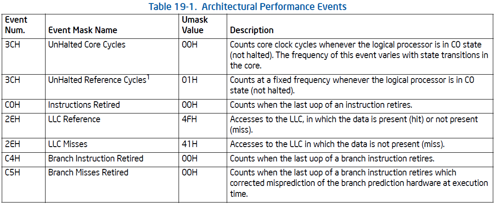
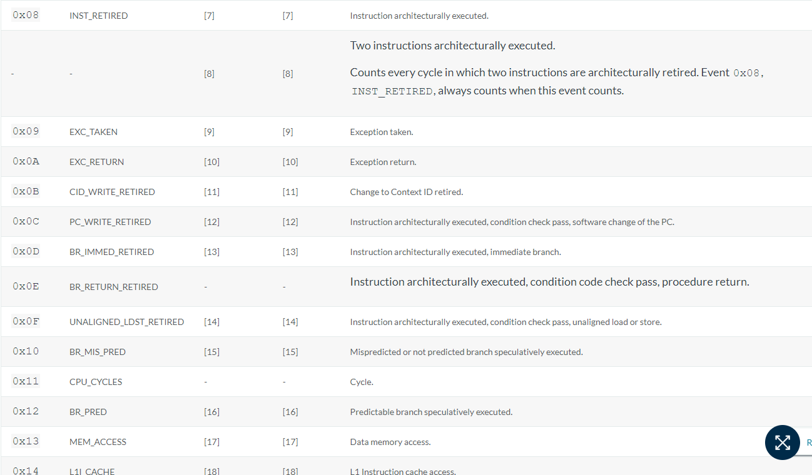
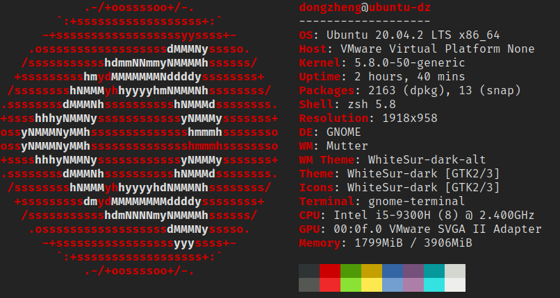

# CS205 Project 4 Report

11812804 董正

---

[TOC]

---

## 1 Introduction

The documentation of class `matrix` is hosted on [my GitHub](https://xdzhelheim.github.io/CS205_C_CPP_Lab/classmatrix.html).


Alternatively, view this report online [here](https://xdzhelheim.github.io/CS205_C_CPP_Lab/md__r_e_a_d_m_e.html).

### 1.1 Project Description

This project is to design a class for matrices.

1. The class should contain the data of a matrix and related information.
2. The class support different data types.
3. Do not use memory hard copy if a matrix object is assigned to another.
4. Implement some frequently used operators.
5. Implement region of interest (ROI) to avoid memory hard copy.
6. Test the program on X86 and Arm platforms, and describe the differences.

### 1.2 Development Environment

* x86_64

  * Windows 10 Home China x86_64

  * Kernel version `10.0.19042`
  * `Intel i5-9300H (8) @ 2.400GHz`

  * `g++.exe (tdm64-1) 10.3.0`

  * C++ standard: `c++11`

* Arm64

  * `macOS 12.0.1 21A559 arm64`
  * Darwin Kernel Version `21.1.0`
  * Apple M1 Pro (10-cores)
  * `Apple clang version 13.0.0 (clang-1300.0.29.3)`
  * C++ standard: `c++11`

## 2 Design and Implementation

Header files and macros used in this section:

```c++
#include <fstream>
#include <iostream>

#define STRASSEN_LOWER_BOUND 128
```

### 2.1 Fields Of Matrix Class

To support different data types, I used template class.

`matrix` class has three basic fields:

```c++
template <typename T>
class matrix {
    int nrows;
    int ncols;
    T* data;
    
    ...
}
```

`data` is a 1D dynamic array containing all the elements of the matrix.

To avoid memory copy, I added a field named `ref_count`:

```c++
int* ref_count;
```

See details in section 2.2 below.

To support ROI, I used another pointer:

```c++
const matrix<T>* parent_matrix;
```

### 2.2 Constructor: Avoid Mem Copy

As the project required, it is forbidden to use hard copy if a matrix object is assigned to another.

If use soft copy directly, there will be an error when freeing `data` array:

```c++
matrix<int> m2 = m1; // will set m2.data = m1.data
```

Therefore, when destructing `m1` and `m2`, since their `data` field is pointing to the same address, the array will be freed twice.

A solution is to override destructor and do not free `data`. But it will cause memory leak.

To solve this, I referenced `cv::Mat` and added a field `int* ref_count`. It serves like a global integer for each allocated array.

The idea is described in the following picture:


When destructing a matrix, just decrease the integer that `ref_count` points to.

Example: delete `m3, m4`.


When `ref_count` decreases to 0, the array will be finally freed.

Therefore, the destructor is:

```c++
template <typename T>
inline matrix<T>::~matrix() { // version 1
    *(this->ref_count) -= 1;
    if (*(this->ref_count) == 0 && this->data != nullptr) {
        delete[] this->data;
        delete this->ref_count;
    }
}
```

And for copy constructor, just do soft copy, and increase `ref_count` by 1.

```c++
template <typename T>
inline matrix<T>::matrix(const matrix<T>& other) {
    this->nrows = other.nrows;
    this->ncols = other.ncols;
    this->parent_matrix = nullptr;

    this->data = other.data;
    this->ref_count = other.ref_count;
    *(this->ref_count) += 1;
}
```

For assignment operator, be sure to free data if it is the last reference of the array.

```c++
template <typename T>
inline matrix<T>& matrix<T>::operator=(const matrix<T>& other) {
    this->nrows = other.nrows;
    this->ncols = other.ncols;

    *(this->ref_count) -= 1;
    if (*(this->ref_count) == 0 && this->data != nullptr) {
        delete this->ref_count;
        delete[] this->data;
    }

    this->data = other.data;
    this->ref_count = other.ref_count;
    *(this->ref_count) += 1;

    return *this;
}
```

### 2.3 ROI For Submatrix

In my understanding, ROI is a concept of submatrix that shares data with its parent matrix.

To use ROI correctly, we need to know the shape of its parent matrix's size. Because when we get the `[i][j]` position element, we need to know the columns of its parent matrix in order to translate `i` and `j` to the correct position in the whole array.

i.e. `sub[i][j]==sub.data[i * parent.ncols + j]`.

So the design is very clear. Use a `parent_matrix` pointer to store its parent:


However, here comes two problems with this design.

#### 2.3.1 Multi-level Submatrix

The first is, multi-level submatrix.

One choice is to concatenate them like a linked-list:


It is unacceptable because `sub_sub_m1[i][j]==sub_sub_m1.data[i * sub_sub_m1->parent_matrix->ncols + j]==sub_sub_m1.data[i * sub_m1.ncols + j]` and it is wrong.

Therefore, we must let all the submatrices point to the root matrix.


Thus, the submatrix construction function is:

```c++
template <typename T>
matrix<T> matrix<T>::submatrix_ROI(int row_start, int row_end, int col_start, int col_end) {
    matrix<T> res;
    res.nrows = row_end - row_start;
    res.ncols = col_end - col_start;

    if (this->parent_matrix == nullptr) {
        res.data = this->data + row_start * this->ncols + col_start;
        res.parent_matrix = this;
    } else {
        res.data = this->data + row_start * this->parent_matrix->ncols + col_start;
        res.parent_matrix = this->parent_matrix;
    }

    res.ref_count = this->ref_count;
    *(res.ref_count) += 1;

    return res;
}
```

#### 2.3.2 Submatrix Deletion

The second problem is the case that delete parent matrix before delete all submatrices.


When delete `sub_m1`, we should delete `m1.data`, not `sub_m1.data` because it is not the head address.

Therefore, `~matrix()` should be modified:

```c++
template <typename T>
inline matrix<T>::~matrix() {
    *(this->ref_count) -= 1;
    if (*(this->ref_count) == 0 && this->data != nullptr) {
        if (this->parent_matrix == nullptr) {
            delete[] this->data;
        } else {  // it is a submatrix
            delete[] this->parent_matrix->data;
        }
        delete this->ref_count;
    }
}
```

#### 2.3.3 ROI Adjustment

Change the address of `data` pointer.

```c++
template <typename T>
void matrix<T>::adjust_ROI(int row_start, int row_end, int col_start, int col_end) {
    if (this->parent_matrix == nullptr) {
        cout << "ROI adjustment error: not a submatrix." << endl;
        exit(EXIT_FAILURE);
    }

    if (row_start < 0 || row_end > this->parent_matrix->nrows || col_start < 0 || col_end > this->parent_matrix->ncols) {
        cout << "ROI adjustment error: array index out of bound." << endl;
        exit(EXIT_FAILURE);
    }

    this->nrows = row_end - row_start;
    this->ncols = col_end - col_start;
    this->data = this->parent_matrix->data + row_start * this->parent_matrix->ncols + col_start;
}
```

### 2.4 Matrix Operations

#### 2.4.1 Index Operator

Since the data is stored in a 1d array, we need an API to access elements like a 2d array. Be careful of submatrices.

```c++
template <typename T>
inline T* matrix<T>::operator[](int i) {
    if (i > this->nrows - 1) {
        cout << "Index error: array index out of bound." << endl;
        exit(EXIT_FAILURE);
    }

    if (this->parent_matrix != nullptr) {
        return this->data + i * this->parent_matrix->ncols;
    }
    return this->data + i * this->ncols;
}

template <typename T>
inline T& matrix<T>::operator()(int i, int j) {
    if (i > this->nrows - 1 || j > this->ncols - 1) {
        cout << "Index error: array index out of bound." << endl;
        exit(EXIT_FAILURE);
    }
    if (this->parent_matrix != nullptr) {
        return this->data[i * this->parent_matrix->ncols + j];
    }

    return this->data[i * this->ncols + j];
}
```

#### 2.4.2 Other Functions

```c++
bool operator==(matrix<T>& other);
bool operator!=(matrix<T>& other);
matrix<T> operator+(matrix<T>& other);
matrix<T> operator-(matrix<T>& other);
matrix<T> operator*(matrix<T>& other);
matrix<T> operator*(T coef);
template <typename U> friend matrix<U> operator*(int coef, matrix<U>& m);
matrix<T> operator^(int expo); // fast power algo
matrix<T>& operator*=(matrix<T>& other);
matrix<T>& operator*=(T coef);
matrix<T>& operator+=(matrix<T>& other);
matrix<T>& operator-=(matrix<T>& other);
matrix<T> multiply_elements(matrix<T>& other);

static matrix<T> merge_matrix(matrix<T>& C11, matrix<T>& C12, matrix<T>& C21, matrix<T>& C22);

int get_nrows();
int get_ncols();
int* shape();
void print_shape();
bool shape_equals(matrix<T>& other);

matrix();
matrix(int nrows, int ncols);
matrix(int nrows, int ncols, T fill);
matrix<T> copy(); // hard copy

static matrix<T> create_row_vec(int ncols, T fill);
static matrix<T> create_col_vec(int nrows, T fill);
static matrix<T> create_diagonal(int nrows, T fill);
static matrix<T> read_matrix(const char* file_name);
void print(const char* file_name);
void print();
```

Check their description and usage in the [document](https://xdzhelheim.github.io/CS205_C_CPP_Lab/classmatrix.html).

## 3 x86 and Arm

### 3.1 Metrics

Speaking to differences between x86 and Arm, the first thought in my head is instructions. x86 is a CISC instruction set and Arm is a RISC instruction set. So to compare them, the most obvious metrics is the number of instructions executed. We expect that Arm will execute much more instructions than x86 on the same program.

However, counting the number of instructions need CPU and operating system's API support. Inside most CPU there is a PMU (Performance Monitoring Unit) that counts information on machine-level. Luckily Linux  has a tool `perf` to access PMU.

The command is `perf stat <program>`. However, I tried it on three different Linux computers (my PC, my lab's server, Huawei's server) and it just did not work.

```bash
[dongzheng@ecs001-0021-0032 ~]$ perf stat -v ls
Using CPUID 0x00000000480fd010
Warning:
cycles event is not supported by the kernel.
Warning:
instructions event is not supported by the kernel.
Warning:
branches event is not supported by the kernel.
Warning:
branch-misses event is not supported by the kernel.
htop-2.2.0-8.fc32.aarch64.rpm  neofetch-7.1.0-1.5.noarch.rpm  openEuler_aarch64.repo  test.cpp
task-clock: 740580 740580 740580
context-switches: 0 740580 740580
cpu-migrations: 0 740580 740580
page-faults: 61 740580 740580
failed to read counter cycles
failed to read counter instructions
failed to read counter branches
failed to read counter branch-misses

 Performance counter stats for 'ls':

              0.74 msec task-clock                #    0.797 CPUs utilized
                 0      context-switches          #    0.000 K/sec
                 0      cpu-migrations            #    0.000 K/sec
                61      page-faults               #    0.082 M/sec
   <not supported>      cycles
   <not supported>      instructions
   <not supported>      branches
   <not supported>      branch-misses

       0.000929716 seconds time elapsed

       0.000965000 seconds user
       0.000000000 seconds sys
```

It all showed `<not supported>` on these three different Linux systems, which is very weird. Then I spent all day finding solutions on foreign websites, and I failed. All the configs are right and god knows why it doesn't work.

```bash
[dongzheng@ecs001-0021-0032 ~]$ cat /usr/src/kernels/4.19.90-2003.4.0.0036.oe1.aarch64/.config | grep CONFIG_HW_PERF_EVENTS
CONFIG_HW_PERF_EVENTS=y
[dongzheng@ecs001-0021-0032 ~]$ cat /usr/src/kernels/4.19.90-2003.4.0.0036.oe1.aarch64/.config | grep CONFIG_PERF_EVENTS
CONFIG_PERF_EVENTS=y
```

Then I started to read Intel and Arm's PMU manual to get information about perf events.

In *Intel(R) 64 and IA-32 Architectures Software Developer's Manual Volume 3B*, section 19.1, there is a table:



To get these counters, use `perf stat -e r<umask><event#> <program>`. And I found the cycles counter (0x003c) work.

On my lab's server (Intel Xeon Gold 6240)

```bash
undergrad1@s001:~/dz$ perf stat -e r003c ls
LightGBM.tar.gz  log  supersegment

 Performance counter stats for 'ls':

         1,742,296      r003c

       0.000919820 seconds time elapsed

```

So I found a way to count CPU cycles.

And for Arm's CPU, look up its ISA first.

On Arm server:

```bash
[dongzheng@ecs001-0021-0032 ~]$ cat /proc/cpuinfo
processor       : 0
BogoMIPS        : 200.00
Features        : fp asimd evtstrm aes pmull sha1 sha2 crc32 atomics fphp asimdhp cpuid asimdrdm jscvt fcma dcpop asimddp asimdfhm
CPU implementer : 0x48
CPU architecture: 8
CPU variant     : 0x1
CPU part        : 0xd01
CPU revision    : 0

...
```

Referring to `MIDR` register. The CPU of this server is HiSilicon's Kunpeng-920 r1p0, ARMv8.

Then find an ARMv8 architecture CPU on Arm's document, eg. Cortex-A53. In PMU events section, there is another [table](https://developer.arm.com/documentation/ddi0500/j/Performance-Monitor-Unit/Events?lang=en):



The event number of CPU cycles is `0x11`.

Therefore, to count CPU cycles, use `perf stat -e r11 <program>`, and it did work.

```bash
[dongzheng@ecs001-0021-0032 ~]$ perf stat -v -e r11 ls
Using CPUID 0x00000000480fd010
htop-2.2.0-8.fc32.aarch64.rpm  neofetch-7.1.0-1.5.noarch.rpm  openEuler_aarch64.repo  test.cpp
r11: 2147483647 728390 728390

 Performance counter stats for 'ls':

     2,147,483,647      r11

       0.000918686 seconds time elapsed

       0.000957000 seconds user
       0.000000000 seconds sys

```

Finally, I found a way to compare CPU cycles.

### 3.2 Test Platform

x86_64:



Arm64:


### 3.3 Dataset & Test Cases

Use the same dataset as **project3**, the dimension of matrices are 32, 64, 128, 256, 512, 1024 and 2048.

The test program is still matrix multiplication, compiled with `set(CMAKE_BUILD_TYPE "Release")` to get maximum compiler optimization.

For each dimension, run it for 10 times and calculate average to improve accuracy.

### 3.4 Comparison On Matrix Multiplication


### 3.5 References

[How can I get the number of instructions executed by a program?](https://stackoverflow.com/questions/31073882/how-can-i-get-the-number-of-instructions-executed-by-a-program)

[why does perf stat show "stalled-cycles-backend" as \<not supported\>?](https://stackoverflow.com/questions/22712956/why-does-perf-stat-show-stalled-cycles-backend-as-not-supported)

[Why can't I find hardware cache event in my perf list?](https://unix.stackexchange.com/questions/273893/why-cant-i-find-hardware-cache-event-in-my-perf-list)

[Perf Wiki Tutorial](https://perf.wiki.kernel.org/index.php/Tutorial)

[Intel(R) 64 and IA-32 Architectures Software Developer's Manual Volume 3B: System Programming Guide](http://www.intel.com/content/dam/www/public/us/en/documents/manuals/64-ia-32-architectures-software-developer-vol-3b-part-2-manual.pdf)

[Using the perf utility on Arm](https://falstaff.agner.ch/2015/10/26/using-the-perf-utility-on-arm/)

[PERF tutorial: Counting hardware performance events](https://sandsoftwaresound.net/perf/perf-tut-count-hw-events/)

[Arm CPU Vendor 及 Part ID 映射关系](https://kunpengcompute.github.io/2020/04/03/arm-cpu-vendor-ji-part-id-ying-she-guan-xi-chi-xu-geng-xin/)

[Arm Cortex-A53 MPCore Processor Technical Reference Manual](https://developer.arm.com/documentation/ddi0500/j/Performance-Monitor-Unit/Events?lang=en)

## 4 Conclusion

In this project, I learnt to design a complete class in C++, especially overriding the operators.

I learned how to manage memory when using soft copy. And a new concept ROI and its manipulations.

In addition, I learned how to use `doxygen` to generate docs for C++ source codes.

And I compared the performance of x86 and Arm ISA. Thus, I had a better understanding on different architectures.

