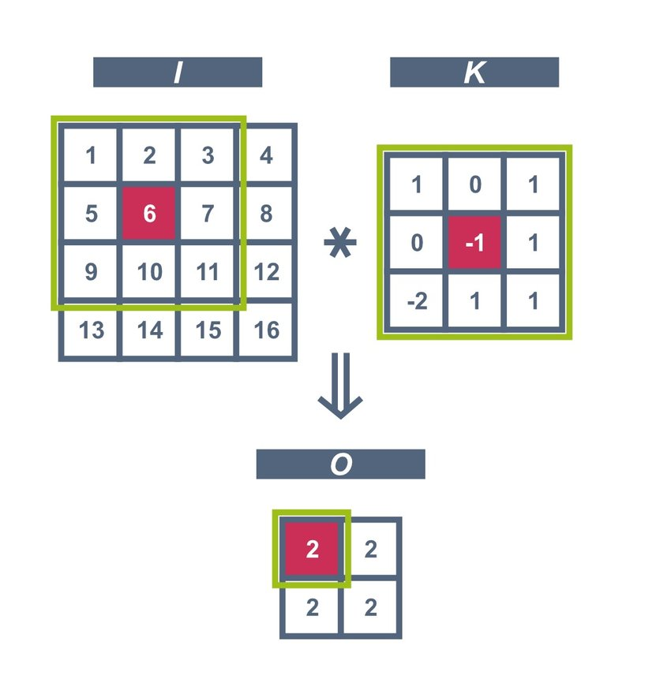

# CS205 Project 5 Report

11812804 董正

---

## 1 Introduction

Since it is the last project of this semester, I finally made my git repo public at:

https://github.com/XDZhelheim/CS205_C_CPP_Lab

### 1.1 Project Description

This project is to implement a simple CNN forwarding procedure.

1. The model contains 3 convolutional layers and 1 fully connected layer.
2. The model can predict if the input image is a person (upper body only) or not.
3. Implement more CNN layers.
4. Make the implemented CNN to be more general.
5. The convolutional operation can be implemented by matrix multiplication.
6. Use OpenCV to read images.
7. Test program on X86 and ARM platforms.

My program gave a general implementation of CNN forwarding, with every part modularized. For example, I designed classes for each type of layer, thus, users can add layers and adjust their order in need. And the convolution kernel supports different size (but must be square), and the matrix can be any size, not just square.

### 1.2 Development Environment

* x86_64

  * Windows 10 Home China x86_64

  * Kernel version `10.0.19042`
  * `Intel i5-9300H (8) @ 2.400GHz`

  * `g++.exe (tdm64-1) 10.3.0`

  * C++ standard: `c++11`
* Arm64

  * `macOS 12.0.1 21A559 arm64`
  * Darwin Kernel Version `21.1.0`
  * Apple M1 Pro (10-cores)
  * `Apple clang version 13.0.0 (clang-1300.0.29.3)`
  * C++ standard: `c++11`

## 2 Design and Implementation

### 2.1 Convolution

For matrix convolution, the basic idea is element-wise multiplication and calculate sum:



This can be done by `submatrix()` and element multiplication.

In addition, there are two parameters for convolution.

* `bool padding`

  If true, do padding, and the convolution result has the same size as the original matrix when stride is 1.

  If false, it is just the figure above, the output size will be shrank slightly.

* `int stride`

  This parameter defines the moving step of the sliding kernel. If stride is 2, the kernel will move 2 step for each iteration, and the output size will be halved.

Combining these two parameters, we can calculate that the output size is:

`[(nrows+2*padding-kernel_size)/stride+1, (ncols+2*padding-kernel_size)/stride+1]`

Therefore, to implement convolution, we first create a result matrix as this size. And extract submatrix according to the kernel. Then do element-wise multiplication with kernel. Calculate the sum and put it into the result matrix.

It is easy to implement but not efficient. There is another way to do convolution with matrix multiplication.


The theory is shown above. To achieve this, I first implemented `reshape()` function to change the shape of the matrix. Since we store the data in a 1d array, just modify the `nrows` and `ncols` member of the matrix. The whole process is:

* Extract each submatrix according to `padding` and `stride`.
* Reshape the submatrices as row vectors and stack them together.
* Reshape the kernel as a column vector.
* Matrix multiplication, and the result is a column vector.
* Reshape the column vector to get the result.

In my implementation, I did not limit the size of matrices and kernels. Therefore, the matrix can be any rectangle and the kernel can be any size.

Further, this process can be extended to multiple channels (called vectorization). However, this contradicts a lot with my pre-defined data structure, so I did not implement this.

### 2.2 Data Structure

To store multiple channels, I used a matrix of matrix, i.e. `Matrix<Matrix<float>>`. I know this is not efficient, but through this we can get a logical representation of the data in CNN, and also for better generalization.

For example, the weight of convolutional layer is stored in a matrix of matrices:


Every layer is based on this data structure.

### 2.3 Layers

The CNN structure is based on different layers. To achieve a general interface, I designed an abstract base class `Layer`, and then extend various layers from it. 

```c++
typedef Matrix<Matrix<float>> M2D;
```


And for CNN class, I designed an interface to put these layers together:

```c++
class CNN {
   private:
    vector<Layer*> layers;

   public:
    void add_layer(Layer* l);

    M2D load_image(const char* image_path, int image_size);
    M2D predict(const char* image_path, int image_size);

    static void face_detection(const char* image_path, bool p_flag = false);
};
```

To achieve the same structure as `demo.py`, just:

```c++
CNN cnn;
cnn.add_layer(new ConvBNLayer(conv_params[0]));
cnn.add_layer(new ReLULayer());
cnn.add_layer(new MaxPoolingLayer(2, 2));
cnn.add_layer(new ConvBNLayer(conv_params[1]));
cnn.add_layer(new ReLULayer());
cnn.add_layer(new MaxPoolingLayer(2, 2));
cnn.add_layer(new ConvBNLayer(conv_params[2]));
cnn.add_layer(new ReLULayer());
cnn.add_layer(new FCLayer(fc_params[0]));
cnn.add_layer(new SoftmaxLayer());
```

Therefore, it is free to change the structure of the CNN as you wish.

By calling `predict`, the input image will start operations on each layer.

```c++
M2D CNN::predict(const char* image_path, int image_size) {
    M2D res = load_image(image_path, image_size);
    for (auto l : this->layers) {
        res = l->forward(res);
    }
    return res;
}
```

For image reading, use `cv::imread` and extract the data. Note that the array after reading image is `[b0, g0, r0, b1, g1, r1, ...]` and should be changed to `[r0, r1, r2, ..., g0, g1, g2,...  b0, b1, b2, ...]`, which cost a lot of my time to debug.

---

## 3 Empirical Verification


